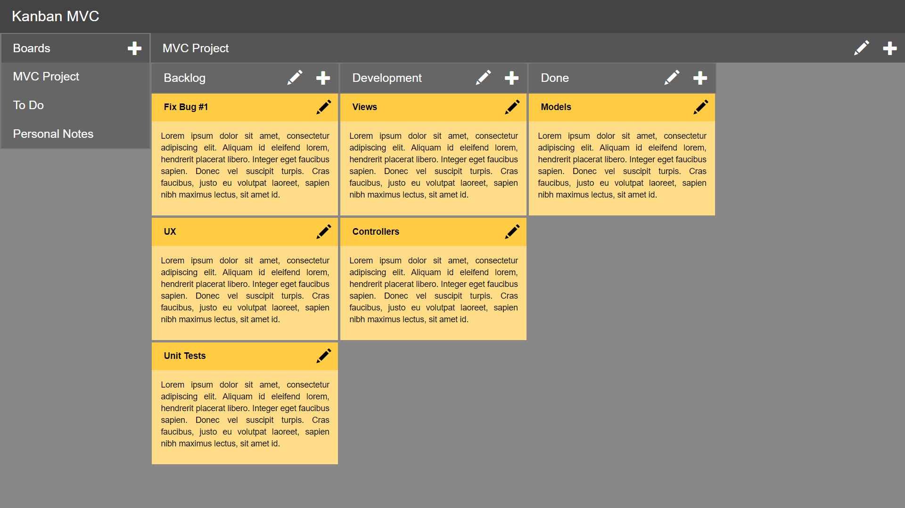
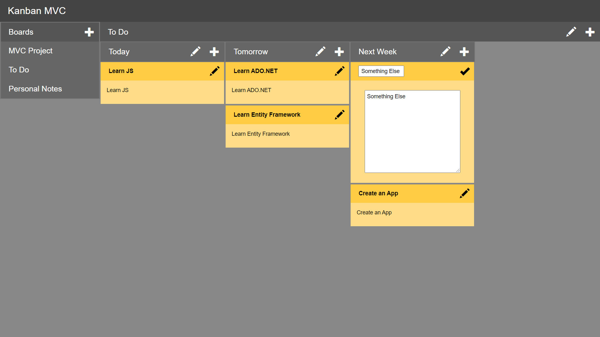
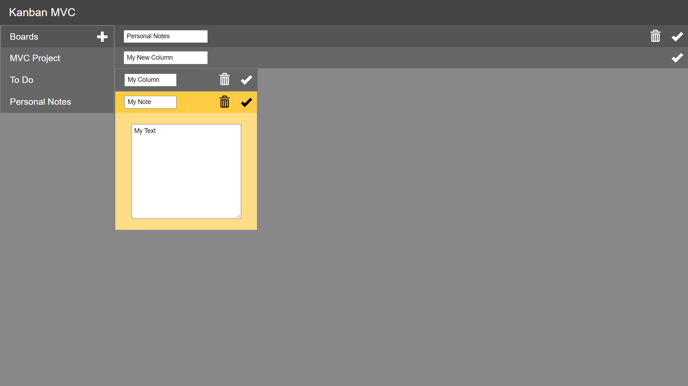

# core-kanban-mvc
The evolution of my previous version of a Kanban Board app, but this time updated to .NET Core 6

## Screens

### Viewing a board

### Creating a new note

### Various inputs for editing and creation
